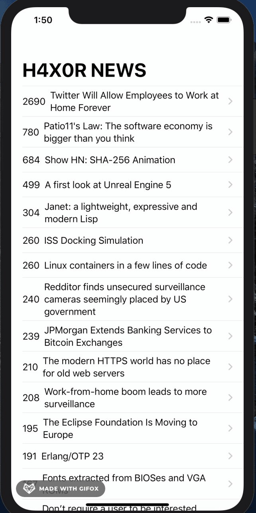
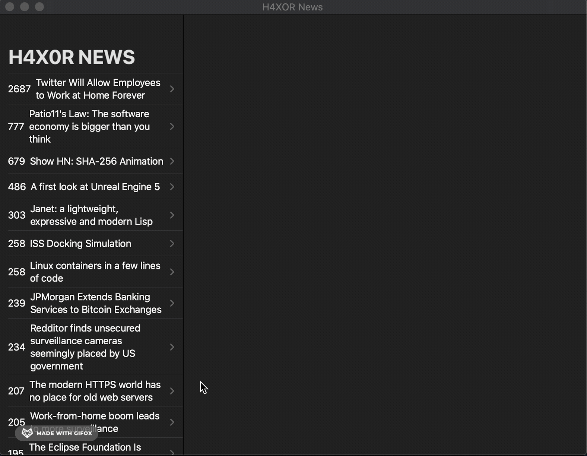

# H4XOR News (Hacker News)

## Demo
#### iPhone Demo

#### Mac OS demo

## Goal

The objective of this tutorial is to continue practice with Apple's new SwiftUI and gain more practice working with APIs.

## What I created

An app that takes the top scoring articles from Hacker News and displays them on iPhone and iMac. Clicking an article headline will segue into an online viewer of the article.

## What I learned

* How to work with SwiftUI Lists and the identifiable Protocol.
* Using navigation view to navigate between the list and a detail view.
* Advanced State management using the Observer Design Pattern.
* Incorporation of UIKit component into SwiftUI by using WebKit to display web pages directly in app
* Using project catalina to create macOS applications

>This is a companion project to The App Brewery's Complete App Development Bootcamp, check out the full course at [www.appbrewery.co](https://www.appbrewery.co/)

